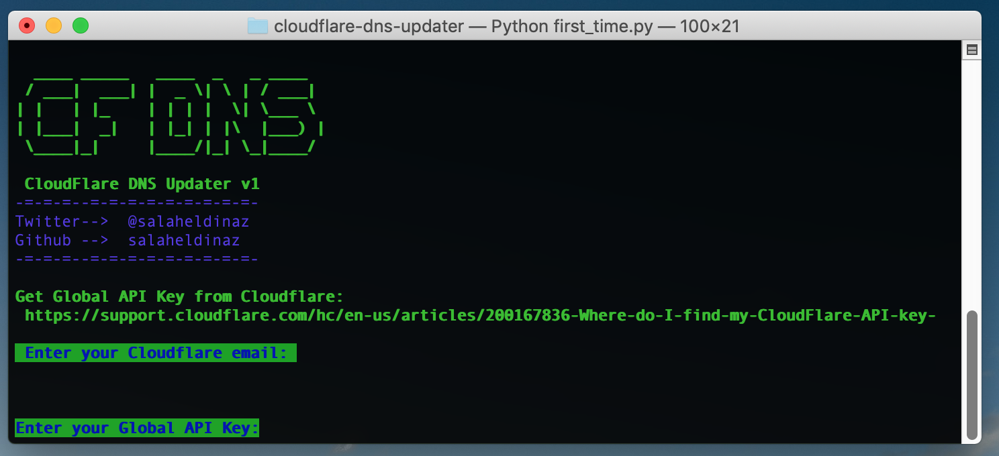

# CloudFlare DNS Updater
>version v1

DNS records updater for use with CloudFlare. 
Written in Python using CloudFlare API v4.

_I made this mainly to update my domain DNS A record daily._


> 


## Prerequisite
- Python 3.5+
- Python modules:
   - simplejson
   - style
   - requests
   
To install python required modules :
```shell
pip3 install -r requirements.txt
```

## Installing
This script can be run from terminal, no install required.
> API Keys will be saved in `api_data.json`

> Logs will be saved in `cf.log`

## Configuration
1. Run `first_time.py` 
```shell
python3 first_time.py
```

2. Enter your details :
- CloudFlare email
- [Globle API key](https://support.cloudflare.com/hc/en-us/articles/200167836-Where-do-I-find-my-CloudFlare-API-key-)
 ###### API Key: The API key given by CloudFlare at the bottom of your "My Account" page

3. Select domain and dns record to update.
 
###### Domain: The root domain name you wish to update (example.com).
###### Email: The email address associated with your CloudFlare account.

## Schedule update
Once you have verified the application is updating your records as intended,
you may schedule it to run at regular time intervals.
Add `updater.py` to your schedule tasks software.

Example: In linux I use `crontab` to check and update server ip every day at 12:30 a.m:
```shell
29 0 * * * /usr/bin/python3 /path/to/updater.py
```


## Todo list
- Add more detailed error messages
- Filter DNS records to just records accept ip as value

## External Resources
> [Cloudflare API documentation](https://api.cloudflare.com/) 

